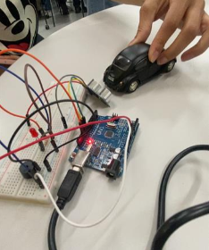

# 🚗 **Sensor de Ré**

  

  

---

## 📖 **Descrição**
Este projeto utiliza um **sensor de distância ultrassônico** para criar um sistema de sensor de ré. Ele é capaz de medir a distância entre o veículo e obstáculos próximos, ativando alertas visuais e sonoros para auxiliar o motorista.

---

## 🛠 **Componentes Utilizados**
- **Arduino Uno R3**
- **Sensor de distância ultrassônico** (quatro pinos)
- **LED vermelho**
- **Resistor - 150 Ω**
- **Piezo**
- **Resistor - 1 kΩ**
- **Protoboard**

---

## ⚙️ **Funcionamento**
1. O sensor emite pulsos ultrassônicos pelo pino `trig` e recebe o retorno pelo pino `echo`, calculando a distância.
2. Se o objeto estiver a até **100 cm**:
   - O **LED vermelho** acende.
   - O **buzzer piezo** emite um som.
3. A distância é exibida no monitor serial.

---
